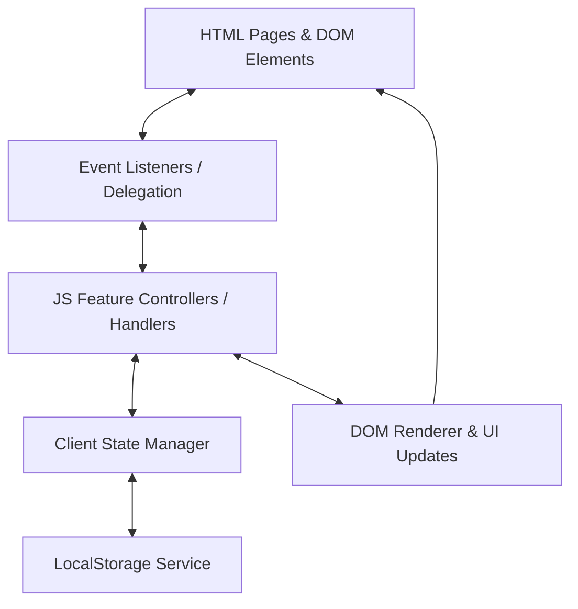
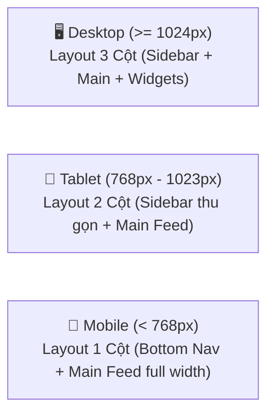

# 🏗️ Kiến Trúc Hệ Thống & UI/UX Design System

> **Dự án**: Website Thảo Luận và Chia Sẻ Tài Nguyên Học Tập (StudyHub)  
> **Công nghệ**: Vanilla HTML5, CSS3 & JavaScript (ES6 Modules / Standard Scripts)  

---

## 📐 1. Mẫu Kiến Trúc Mô-đun Frontend (Frontend Architecture)

Dự án áp dụng mô hình **Event-Driven Component Architecture** kết hợp với **Storage Manager Pattern** hoàn toàn bằng Vanilla JS, giúp mã nguồn sạch, dễ mở rộng và dễ bảo trì mà không cần đến các thư viện ngoài.



### 1.1. Các Lớp Xử Lý Chính

1. **View Layer (HTML Pages)**:
   * Chứa các thành phần giao diện Semantic HTML5.
   * `index.html` (Feed thảo luận), `documents.html` (Kho tài liệu), `profile.html` (Trang cá nhân), `moderation.html` (Dashboard kiểm duyệt).

2. **Event & Controller Layer (`assets/js/*.js`)**:
   * **`storage.js`**: Đóng vai trò Data Access Layer (DAL), thực hiện CRUD dữ liệu trên `localStorage` và tự động cấp dữ liệu mẫu (Initial Seed Data).
   * **`auth.js`**: Quản lý phiên đăng nhập (Session), xác thực mật khẩu, kiểm tra vai trò người dùng (`student`, `moderator`).
   * **`posts.js`**: Xử lý logic đăng bài, chỉnh sửa, lọc bài viết theo bạn bè/phạm vi, xử lý thả cảm xúc, thêm/sửa bình luận & đính kèm liên kết media.
   * **`documents.js`**: Xử lý logic đăng tài liệu học tập, lọc theo môn học, tìm kiếm từ khóa, sắp xếp và lưu tài nguyên.
   * **`friends.js`**: Xử lý gửi lời mời kết bạn, chấp nhận/từ chối và quản lý danh sách bạn bè.
   * **`moderation.js`**: Dashboard duyệt bài, xử lý báo cáo vi phạm, tính toán số liệu thống kê hệ thống.
   * **`utils.js`**: Chứa các hàm tiện ích bảo mật (Sanitize HTML chống XSS, định dạng thời gian `timeAgo`, hiển thị Toast notification, mở Modal).

3. **Storage Layer (`localStorage`)**:
   * Tất cả dữ liệu ứng dụng được mã hóa JSON và lưu trữ persistent trong trình duyệt của người dùng.

---

## 🎨 2. UI/UX Design System & Quy Chuẩn CSS

Hệ thống giao diện được thiết kế theo phong cách **Modern Academic Social UI** vừa hiện đại, trực quan, vừa chuyên nghiệp.

### 2.1. Bảng Màu Hệ Thống (Color Palette)

Tất cả màu sắc được quản lý tập trung thông qua **CSS Variables** tại file `assets/css/theme.css`:

```css
:root {
  /* Màu chủ đạo (Primary & Brand) */
  --primary-color: #4f46e5;          /* Indigo vibrant */
  --primary-hover: #4338ca;
  --primary-light: #e0e7ff;
  
  /* Màu phụ (Secondary & Accents) */
  --secondary-color: #06b6d4;        /* Cyan accent */
  --success-color: #10b981;          /* Emerald Green for Approve */
  --warning-color: #f59e0b;          /* Amber for Pending/Reports */
  --danger-color: #ef4444;           /* Red for Reject/Delete */

  /* Neutral Scale (Nền & Chữ) */
  --bg-main: #f8fafc;                /* Slate 50 background */
  --bg-surface: #ffffff;             /* Card white background */
  --bg-sidebar: #ffffff;
  --text-main: #0f172a;              /* Slate 900 primary text */
  --text-muted: #64748b;             /* Slate 500 secondary text */
  --border-color: #e2e8f0;           /* Slate 200 border */

  /* Shadows & Elevation */
  --shadow-sm: 0 1px 2px 0 rgba(0, 0, 0, 0.05);
  --shadow-md: 0 4px 6px -1px rgba(0, 0, 0, 0.1), 0 2px 4px -1px rgba(0, 0, 0, 0.06);
  --shadow-lg: 0 10px 15px -3px rgba(0, 0, 0, 0.1), 0 4px 6px -2px rgba(0, 0, 0, 0.05);

  /* Radius & Spacing */
  --radius-sm: 6px;
  --radius-md: 10px;
  --radius-lg: 16px;
  --radius-full: 9999px;
}
```

### 2.2. Quy Chuẩn Typography
* **Font Family**: Google Fonts `'Inter', -apple-system, BlinkMacSystemFont, sans-serif`.
* **Font Sizes**:
  * Heading 1: `1.75rem` (28px) - Tiêu đề trang chính
  * Heading 2: `1.35rem` (21.6px) - Tiêu đề Section / Card
  * Heading 3: `1.1rem` (17.6px) - Tiêu đề Bài viết / Tài liệu
  * Body text: `0.95rem` (15.2px) - Nội dung bài viết & bình luận
  * Meta text: `0.85rem` (13.6px) - Thời gian, lượt like, thông tin tác giả

---

## 📱 3. Responsive Layout Strategy & Breakpoints

Giao diện được thiết kế chuẩn **Mobile-First / Fluid Responsive Layout** sử dụng CSS Flexbox và CSS Grid.



### 3.1. Điểm Ngắt Responsive (Breakpoints)

```css
/* Layout Desktop (Mặc định hoặc min-width: 1024px) */
.app-container {
  display: grid;
  grid-template-columns: 260px 1fr 300px;
  gap: 24px;
  max-width: 1280px;
  margin: 0 auto;
}

/* Layout Tablet (max-width: 1023px) */
@media (max-width: 1023px) {
  .app-container {
    grid-template-columns: 200px 1fr;
  }
  .right-widgets {
    display: none; /* Thu gọn widget bên phải vào menu dropdown */
  }
}

/* Layout Mobile (max-width: 767px) */
@media (max-width: 767px) {
  .app-container {
    grid-template-columns: 1fr;
    padding: 0 12px;
  }
  .left-sidebar {
    display: none; /* Đưa sidebar xuống Bottom Navigation Bar */
  }
  .mobile-bottom-nav {
    display: flex;
    position: fixed;
    bottom: 0;
    left: 0;
    right: 0;
    background: var(--bg-surface);
    border-top: 1px solid var(--border-color);
  }
}
```

---

## 🔄 4. Event Delegation Pattern & DOM Rendering

Để tối ưu hiệu năng và đảm bảo code JS chạy mượt khi các phần tử bài viết/bình luận được sinh ra động (dynamic DOM), hệ thống áp dụng kỹ thuật **Event Delegation**:

```javascript
// Ví dụ mẫu về Event Delegation trong posts.js
document.getElementById('post-feed').addEventListener('click', function(e) {
  // Thao tác Thả tim (Like)
  const likeBtn = e.target.closest('.btn-like');
  if (likeBtn) {
    const postId = likeBtn.dataset.postId;
    PostsController.toggleLike(postId);
    return;
  }

  // Thao tác Mở khung bình luận
  const commentBtn = e.target.closest('.btn-toggle-comments');
  if (commentBtn) {
    const postId = commentBtn.dataset.postId;
    UI.toggleCommentSection(postId);
    return;
  }

  // Thao tác Báo cáo bài viết
  const reportBtn = e.target.closest('.btn-report-post');
  if (reportBtn) {
    const postId = reportBtn.dataset.postId;
    UI.openReportModal(postId);
    return;
  }
});
```

---

## 🛡️ 5. Xử Lý Bảo Mật & Sanitize Dữ Liệu (XSS Prevention)

Do dự án cho phép người dùng nhập nội dung bài viết, đính kèm đường dẫn ảnh/video và bình luận, hệ thống tích hợp hàm lọc dữ liệu **`Sanitize HTML`** tại `assets/js/utils.js`:

```javascript
const Utils = {
  // Chống tấn công XSS bằng cách escape các ký tự nguy hại
  escapeHTML(str) {
    if (!str) return '';
    return str
      .replace(/&/g, '&amp;')
      .replace(/</g, '&lt;')
      .replace(/>/g, '&gt;')
      .replace(/"/g, '&quot;')
      .replace(/'/g, '&#039;');
  },

  // Kiểm tra liên kết ảnh/video an toàn trước khi nhúng
  isValidMediaURL(url) {
    try {
      const parsed = new URL(url);
      return ['http:', 'https:'].includes(parsed.protocol);
    } catch {
      return false;
    }
  }
};
```
