# 🗄️ Mô Hình Dữ Liệu & LocalStorage Schema

> **Dự án**: Website Thảo Luận và Chia Sẻ Tài Nguyên Học Tập (StudyHub)  
> **Phương thức lưu trữ**: Trình duyệt `localStorage` (Giả lập Database qua JSON)  

---

## 📐 1. Sơ Đồ Thực Thể Mối Quan Hệ (Entity Relationship Diagram - ERD)

```mermaid
erDiagram
    USER ||--o{ POST : "tạo"
    USER ||--o{ DOCUMENT : "chia sẻ / lưu"
    USER ||--o{ COMMENT : "viết"
    USER ||--o{ REPORT : "báo cáo"
    USER ||--o{ FRIENDSHIP : "kết bạn"
    POST ||--o{ COMMENT : "chứa"
    POST ||--o{ REPORT : "bị báo cáo"
    DOCUMENT ||--o{ REPORT : "bị báo cáo"
    MODERATOR ||--o{ MODERATION_QUEUE : "duyệt"

    USER {
        string id PK
        string username
        string password
        string fullName
        string email
        string role "student | moderator"
        string avatar
        string department
        array savedDocIds
    }

    POST {
        string id PK
        string userId FK
        string title
        string content
        string category
        string visibility "Public | Friends | Only Me"
        string status "approved | pending | rejected"
        array likes
        datetime createdAt
    }

    DOCUMENT {
        string id PK
        string userId FK
        string title
        string description
        string fileUrl
        string subject
        string visibility "Public | Friends"
        int viewsCount
        int savesCount
        datetime createdAt
    }

    COMMENT {
        string id PK
        string postId FK
        string userId FK
        string parentId FK "Dành cho reply lồng nhau"
        string content
        string mediaUrl "Link ảnh hoặc video embed"
        datetime createdAt
    }

    REPORT {
        string id PK
        string reporterId FK
        string targetType "post | document"
        string targetId FK
        string reason
        string status "pending | resolved | dismissed"
        datetime createdAt
    }

    FRIENDSHIP {
        string id PK
        string requesterId FK
        string receiverId FK
        string status "pending | accepted | blocked"
        datetime updatedAt
    }
```



---

## 💾 2. Chi Tiết Các Bảng Dữ Liệu (JSON Schemas)

Các khóa (Keys) lưu trữ trên `localStorage` được đặt tiền tố `studyhub_` để tránh xung đột dữ liệu:

### 2.1. Key: `studyhub_users` (Danh sách người dùng)

```json
[
  {
    "id": "usr_001",
    "username": "student_an",
    "password": "hashed_or_plain_password_123",
    "fullName": "Nguyen Van An",
    "email": "an.nguyen@student.edu.vn",
    "role": "student",
    "avatar": "assets/images/avatars/user1.png",
    "department": "Công nghệ thông tin",
    "bio": "Sinh viên khóa 2024 - Đam mê lập trình Web",
    "savedDocIds": ["doc_101", "doc_103"],
    "createdAt": "2026-09-01T08:00:00.000Z"
  },
  {
    "id": "usr_mod01",
    "username": "mod_teacher",
    "password": "admin_password_123",
    "fullName": "Lecturer Tran Duc",
    "email": "duc.tran@faculty.edu.vn",
    "role": "moderator",
    "avatar": "assets/images/avatars/mod.png",
    "department": "Khoa Mạng máy tính",
    "bio": "Giảng viên kiểm duyệt nội dung cộng đồng",
    "savedDocIds": [],
    "createdAt": "2026-08-15T08:00:00.000Z"
  }
]
```

---

### 2.2. Key: `studyhub_posts` (Danh sách bài thảo luận)

```json
[
  {
    "id": "post_501",
    "userId": "usr_001",
    "authorName": "Nguyen Van An",
    "authorAvatar": "assets/images/avatars/user1.png",
    "title": "Hỏi về cách xử lý bất đồng bộ trong JavaScript thuần?",
    "content": "Chào mọi người, mình đang làm bài tập Lập trình mạng tới phần Fetch API / Async Await nhưng chưa hiểu rõ cách handle error khi network bị timeout. Ai có kinh nghiệm chia sẻ giúp mình với ạ!",
    "category": "Lập trình mạng",
    "visibility": "Public",
    "status": "approved",
    "likes": ["usr_002", "usr_mod01"],
    "dislikes": [],
    "commentsCount": 3,
    "createdAt": "2026-09-17T10:00:00.000Z"
  }
]
```

---

### 2.3. Key: `studyhub_comments` (Danh sách bình luận)

```json
[
  {
    "id": "cmt_801",
    "postId": "post_501",
    "userId": "usr_mod01",
    "authorName": "Lecturer Tran Duc",
    "authorAvatar": "assets/images/avatars/mod.png",
    "parentId": null,
    "content": "Bạn nên bọc đoạn code `await fetch(...)` trong khối `try...catch` và dùng `Promise.race` để đặt timeout nhé. Bạn xem sơ đồ minh họa này:",
    "mediaUrl": "https://images.unsplash.com/photo-1555066931-4365d14bab8c?w=600",
    "createdAt": "2026-09-17T10:30:00.000Z"
  },
  {
    "id": "cmt_802",
    "postId": "post_501",
    "userId": "usr_001",
    "authorName": "Nguyen Van An",
    "authorAvatar": "assets/images/avatars/user1.png",
    "parentId": "cmt_801",
    "content": "Dạ em cảm ơn thầy ạ, em đã áp dụng thành công rồi!",
    "mediaUrl": null,
    "createdAt": "2026-09-17T10:45:00.000Z"
  }
]
```

---

### 2.4. Key: `studyhub_documents` (Kho tài liệu học tập)

```json
[
  {
    "id": "doc_101",
    "userId": "usr_001",
    "authorName": "Nguyen Van An",
    "title": "Slide Bài giảng & Tổng hợp Đề thi Lập trình mạng 2025",
    "description": "Tài liệu ôn tập tóm tắt kiến thức Socket, HTTP/HTTPS, Web API và bộ đề thi thực hành các năm trước.",
    "fileUrl": "https://example.com/files/LapTrinhMang_OnTap.pdf",
    "fileType": "pdf",
    "subject": "Lập trình mạng",
    "visibility": "Public",
    "viewsCount": 142,
    "savesCount": 38,
    "createdAt": "2026-09-10T14:00:00.000Z"
  }
]
```

---

### 2.5. Key: `studyhub_reports` (Danh sách báo cáo vi phạm)

```json
[
  {
    "id": "rep_301",
    "reporterId": "usr_002",
    "targetType": "post",
    "targetId": "post_509",
    "reason": "Nội dung quảng cáo spam không liên quan tới học tập",
    "status": "pending",
    "priority": "high",
    "createdAt": "2026-09-17T11:00:00.000Z"
  }
]
```

---

### 2.6. Key: `studyhub_friendships` (Danh sách bạn bè)

```json
[
  {
    "id": "fr_901",
    "requesterId": "usr_001",
    "receiverId": "usr_002",
    "status": "accepted",
    "updatedAt": "2026-09-12T09:00:00.000Z"
  }
]
```

---

## ⚙️ 3. Quản Lý Đồng Bộ LocalStorage (`storage.js`)

File `assets/js/storage.js` cung cấp API tĩnh để thao tác an toàn với `localStorage`:

```javascript
const StorageManager = {
  // Lấy dữ liệu theo Key (Tự động parse JSON)
  get(key, defaultValue = []) {
    const data = localStorage.getItem(`studyhub_${key}`);
    return data ? JSON.parse(data) : defaultValue;
  },

  // Lưu dữ liệu vào Key (Tự động stringify JSON)
  set(key, value) {
    localStorage.setItem(`studyhub_${key}`, JSON.stringify(value));
  },

  // Khởi tạo Seed Data mẫu khi truy cập lần đầu
  initSeedData() {
    if (!localStorage.getItem('studyhub_users')) {
      this.set('users', defaultUsersSeed);
      this.set('posts', defaultPostsSeed);
      this.set('documents', defaultDocumentsSeed);
    }
  }
};
```
