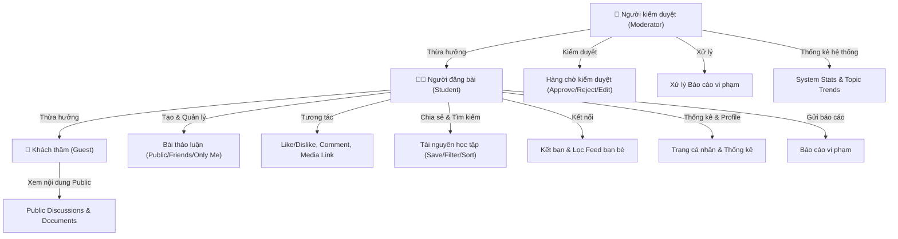

# 📑 Tài Liệu Đặc Tả Yêu Cầu Phần Mềm (SRS) & Thang Điểm

> **Dự án**: Website Thảo Luận và Chia Sẻ Tài Nguyên Học Tập (StudyHub)  
> **Môn học**: Lập trình mạng (2026 - 2027)  
> **Yêu cầu kỹ thuật**: HTML5, CSS3, JavaScript thuần (Vanilla Web Technology)  

---

## 📋 1. Tổng Quan & Quy Định Thi Cuối Kỳ

### 1.1. Mục tiêu Đồ án
Nền tảng được thiết kế nhằm cung cấp không gian học tập trực tuyến cho người học:
* Đặt câu hỏi, trao đổi bài tập, chia sẻ lời giải.
* Chia sẻ tài nguyên học tập (tài liệu PDF, bài giảng, slide, liên kết tham khảo).
* Kết nối với các bạn học khác trong trường/lớp.
* Quản lý & kiểm duyệt nội dung cộng đồng an toàn, văn minh.

### 1.2. Quy chế Thi Vấn đáp & Thực hành
* **Hình thức thực hiện**: Bắt buộc nhóm gồm **2 thành viên**.
* **Vấn đáp độc lập**: Mỗi thành viên phải nắm vững toàn bộ kiến thức và bản chất code của sản phẩm.
* **Cảnh báo vi phạm**: Sinh viên sao chép code dưới mọi hình thức nhưng không giải thích được bản chất khi được hỏi sẽ bị nhận **0 điểm (Hủy kết quả thi)**.

---

## 👥 2. Đặc Tả Tác Nhân Hệ Thống (Actors)

Hệ thống bao gồm 3 tác nhân chính:



---

## ⚙️ 3. Chi Tiết Yêu Cầu Chức Năng (Functional Requirements)

### 3.1. Tác Nhân 1: Người Đăng Bài (Student / Member)

#### UC-01: Quản lý Bài Thảo Luận
* **Đăng bài thảo luận mới**: Cho phép nhập tiêu đề, nội dung chi tiết, gắn chủ đề/môn học.
* **Chọn phạm vi hiển thị (Visibility)**:
  * `Public`: Tất cả mọi người (kể cả Khách thăm) đều xem được.
  * `Friends`: Chỉ những tài khoản đã kết bạn mới xem được.
  * `Only Me`: Chỉ chính tài khoản người đăng mới xem được.
* **Chỉnh sửa & Xóa bài viết**: Người dùng có quyền sửa nội dung bài của chính mình hoặc xóa bài.

#### UC-02: Tương Tác Trong Bài Thảo Luận
* **Thả cảm xúc**: Cho phép thả cảm xúc (Like / Dislike / Heart...).
* **Gửi bình luận**: Nhập bình luận vào bài thảo luận.
* **Đính kèm liên kết đa phương tiện**: Cho phép chèn liên kết hình ảnh (`.jpg`, `.png`) hoặc liên kết video (`YouTube embed` hoặc `.mp4`).
* **Trả lời bình luận (Reply)**: Cho phép trả lời bình luận lồng nhau của người dùng khác.

#### UC-03: Quản Lý & Chia Sẻ Tài Liệu Học Tập
* **Chia sẻ tài nguyên**: Cho phép tải lên/đăng liên kết tài liệu kèm mô tả, danh mục môn học và phạm vi chia sẻ (`Public` / `Friends`).
* **Tìm kiếm & Lọc tài liệu**:
  * Tìm kiếm theo từ khóa tiêu đề hoặc môn học.
  * Lọc theo chủ đề quan tâm, môn học hoặc định dạng tài liệu.
  * Sắp xếp theo: Mới nhất, Đánh giá cao nhất, Lưu nhiều nhất.
* **Lưu & Mở tài liệu**: Lưu tài liệu vào danh sách cá nhân để mở lại sau.

#### UC-04: Tìm Kiếm, Lọc Nội Dung & Báo Cáo
* **Tìm kiếm toàn trang**: Tìm kiếm bài thảo luận, tài liệu, người dùng.
* **Lọc nội dung hữu ích**: Lọc bài viết được nhiều lượt tương tác / đánh giá hữu ích.
* **Báo cáo vi phạm**: Gửi báo cáo nội dung không phù hợp (Spam, nội dung đồi quỵ, xúc phạm...) kèm lý do cho Người kiểm duyệt xử lý.

#### UC-05: Kết Nối Người Dùng & Bạn Bè
* **Kết bạn**: Gửi lời mời kết bạn, chấp nhận hoặc từ chối lời mời.
* **Danh sách bạn bè**: Xem danh sách bạn bè hiện tại.
* **Lọc Feed bài viết**: Xem dòng thời gian bài viết của bạn bè.

#### UC-06: Quản Lý Trang Cá Nhân & Thống Kê
* **Chỉnh sửa profile**: Cập nhật họ tên, avatar, trường/khoa, mô tả bản thân.
* **Thống kê cá nhân**:
  * Tổng số bài thảo luận đã đăng.
  * Tổng số tài liệu đã chia sẻ.
  * Tổng số bài viết/tài liệu đã lưu.

---

### 3.2. Tác Nhân 2: Người Kiểm Duyệt (Moderator / Admin)

#### UC-07: Kiểm Duyệt Nội Dung (Moderation)
* **Xem hàng chờ kiểm duyệt (Moderation Queue)**: Danh sách các bài thảo luận / tài liệu mới đăng cần phê duyệt trước khi xuất hiện trên Public (nếu chế độ duyệt được bật).
* **Đưa ra quyết định**:
  * `Approve` (Duyệt bài cho phép hiển thị).
  * `Request Edit` (Yêu cầu sinh viên chỉnh sửa lại).
  * `Reject / Remove` (Từ chối / Loại bỏ bài vi phạm quy định).

#### UC-08: Xử Lý Báo Cáo Vi Phạm (Report Handling)
* **Tiếp nhận danh sách báo cáo**: Danh sách các nội dung bị sinh viên khác tố cáo.
* **Xử lý báo cáo**:
  * Gỡ bỏ nội dung vi phạm.
  * Gửi cảnh báo tới tài khoản vi phạm.
  * Bỏ qua báo cáo (nếu báo cáo sai).

#### UC-09: Thống Kê & Theo Dõi Hoạt Động Hệ Thống
* **Thống kê tổng quan**: Số lượng thành viên, bài viết, tài liệu, báo cáo đang chờ.
* **Thống kê xu hướng**: Các chủ đề/môn học được thảo luận nhiều nhất, tài liệu được tải/lưu nhiều nhất.
* **Độ ưu tiên hàng chờ**: Phân loại mức độ ưu tiên hàng chờ (Báo cáo khẩn cấp, Bài viết mới...).

---

### 3.3. Tác Nhân 3: Khách Thăm (Guest - Không cần đăng nhập)

#### UC-10: Xem Nội Dung Public
* Truc cập trang chủ và xem danh sách các bài thảo luận được để chế độ `Public`.
* Xem và mở các tài nguyên học tập được chia sẻ ở chế độ `Public`.
* Nút kêu gọi Đăng ký / Đăng nhập khi muốn thả tim, bình luận hoặc tải/lưu tài liệu.

---

## 🎨 4. Yêu Cầu Phi Chức Năng (Non-Functional Requirements)

| Tiêu chí | Mô tả chi tiết |
| :--- | :--- |
| **Công nghệ bắt buộc** | HTML5 Semantic Tags, CSS3 (Flexbox/Grid), JavaScript Vanilla (ES6+). **Không dùng thư viện/framework bên ngoài** như React, Vue, jQuery, Bootstrap hay TailwindCSS. |
| **Giao diện Responsive** | Hiển thị tối ưu và cân đối trên 3 loại màn hình: Desktop (>= 1024px), Tablet (768px - 1023px), Mobile (< 768px). |
| **Lưu trữ dữ liệu phia Client** | Khởi tạo và đồng bộ dữ liệu giả lập (Mock Data) bằng `localStorage` để ứng dụng hoạt động mượt mà mà không cần cài đặt Backend/Database phức tạp. |
| **Bảo mật & Sanitize HTML** | Lọc dữ liệu đầu vào người dùng (Chống tấn công XSS khi hiển thị bình luận, nội dung bài viết và liên kết ảnh/video). |
| **Trải nghiệm người dùng (UX)** | Phản hồi tương tác tức thì (Instant feedback), thông báo dạng Toast, Modal mượt mà, màu sắc hài hòa dễ quan sát. |

---

## 💯 5. Bảng Chi Tiết Thang Điểm Đánh Giá

```text
TỔNG ĐIỂM SẢN PHẨM: 3.0 ĐIỂM (Sản phẩm) + 2.0 ĐIỂM (Vấn đáp) + 5.0 ĐIỂM (Thực hành) = 10.0 ĐIỂM
```

### Chi tiết 3.0 Điểm Sản Phẩm (HTML + CSS + JS)

#### 1. Điểm HTML (Tối đa 0.5 điểm)
* [x] Sử dụng đa dạng các đối tượng HTML5:
  * Form elements: `<form>`, `<input>`, `<textarea>`, `<select>`, `<button>`.
  * Media elements: ``, `<video>`, `<iframe>` (embed YouTube).
  * Structure & Table: `<table>`, `<thead>`, `<tbody>`, `<tr>`, `<td>`.
  * Lists & Semantic: `<ul>`, `<ol>`, `<li>`, `<header>`, `<nav>`, `<main>`, `<aside>`, `<article>`, `<footer>`.

#### 2. Điểm CSS (Tối đa 1.0 điểm)
* [x] Bố cục cân đối, phân chia vùng rõ ràng (Header, Sidebar, Main Feed, Right Widgets).
* [x] Màu sắc hài hòa, chuẩn tương phản (Modern CSS Variables palette).
* [x] Font chữ và kích thước tỷ lệ chuẩn (Modern Typography).
* [x] **Responsive 100%**: Sử dụng CSS `@media` queries đáp ứng Mobile, Tablet, Desktop.

#### 3. Điểm JavaScript (Tối đa 1.5 điểm)
* [x] Chức năng Đăng ký / Đăng nhập & Lưu Session.
* [x] Chức năng Chia sẻ, Tìm kiếm, Lọc, Sắp xếp & Lưu tài liệu.
* [x] Chức năng Kết nối tài khoản (Gửi/Nhận lời mời kết bạn, danh sách bạn bè).
* [x] Chức năng Xử lý bài thảo luận (Đăng, sửa, xóa, thả tim, bình luận, đính kèm media, trả lời bình luận).
* [x] Chức năng Quản lý thông tin cá nhân & Thống kê hoạt động.
* [x] Chức năng Kiểm duyệt nội dung & Dashboard thống kê dành cho Moderator.

---

### Chi tiết 7.0 Điểm Thi (Vấn đáp + Thực hành)

#### 4. Điểm Vấn Đáp (Tối đa 2.0 điểm)
* Trả lời độc lập các câu hỏi của giảng viên về:
  * Cấu trúc DOM và cách tương tác DOM bằng JS (`querySelector`, `addEventListener`, `createElement`).
  * Xử lý dữ liệu bằng `localStorage` và mảng/đối tượng trong JS (`map`, `filter`, `reduce`, `find`).
  * Cách tổ chức layout CSS Responsive (`Flexbox`, `Grid`, `Media Queries`).
* ⚠️ **Lưu ý**: Vấn đáp không hiểu sản phẩm $\rightarrow$ **0 điểm cả bài thi**.

#### 5. Thi Thực Hành Theo Yêu Cầu (Tối đa 5.0 điểm)
* Trực tiếp nhận đề thực hành tại phòng máy và chỉnh sửa/bổ sung tính năng theo yêu cầu của giảng viên trong thời gian quy định.
