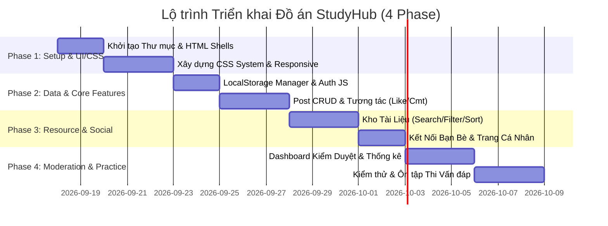

# 📋 Kế Hoạch Triển Khai & Phân Công Nhiệm Vụ (Nhóm 2 Thành Viên)

> **Dự án**: Website Thảo Luận và Chia Sẻ Tài Nguyên Học Tập (StudyHub)  
> **Mục tiêu**: Phân chia công việc cân bằng giữa 2 thành viên, đảm bảo cả 2 sinh viên đều nắm vững bản chất mã nguồn để đạt điểm tối đa trong phần thi **Vấn đáp** và **Thực hành**.

---

## 👥 1. Bảng Phân Công Vai Trò Tổng Quan

| Thành viên | Vai trò chính | Phạm vi phụ trách mã nguồn |
| :--- | :--- | :--- |
| **Sinh viên 1 (Member A)** | **Frontend & UI/UX Developer** | • Thiết kế khung giao diện HTML5 (`index.html`, `documents.html`, `login.html`). • Xây dựng hệ thống CSS (Reset, Theme Variables, Components, Responsive). • Lập trình JS cho tính năng Tài liệu (`documents.js`) & Bạn bè (`friends.js`). |
| **Sinh viên 2 (Member B)** | **Logic & Data Service Developer** | • Xây dựng Lớp quản lý dữ liệu LocalStorage (`storage.js`) & Auth (`auth.js`). • Thiết kế giao diện HTML `profile.html` & `moderation.html`. • Lập trình JS cho Bài thảo luận (`posts.js`), Kiểm duyệt (`moderation.js`) & Tiện ích (`utils.js`). |

---

## 📅 2. Lộ Trình Triển Khai Theo Sprint (Roadmap)

---

## 📝 3. Danh Sách Tác Vụ Chi Tiết (Task List Checklist)

### 🔹 Giai Đoạn 1: Cấu Trúc HTML Shell & CSS Design System
- [ ] **[Sinh viên 1]** Tạo thư mục dự án và khởi tạo các file HTML: `index.html`, `login.html`, `documents.html`.
- [ ] **[Sinh viên 2]** Tạo các file HTML còn lại: `profile.html`, `moderation.html`.
- [ ] **[Sinh viên 1]** Viết `assets/css/theme.css`: Cấu hình CSS Variables (bảng màu, font chữ, shadow, radius).
- [ ] **[Sinh viên 1]** Viết `assets/css/main.css` & `components.css`: Định dạng Cards, Buttons, Form inputs, Modal, Avatar.
- [ ] **[Sinh viên 1]** Viết `assets/css/responsive.css`: Cấu hình Media Queries cho Mobile (< 768px), Tablet (768px - 1023px) và Desktop.

---

### 🔹 Giai Đoạn 2: Xử Lý Quản Lý Dữ Liệu & Bài Thảo Luận (JS Core)
- [ ] **[Sinh viên 2]** Viết `assets/js/storage.js`: Xây dựng `StorageManager` thao tác CRUD trên `localStorage` và dữ liệu Seed mẫu.
- [ ] **[Sinh viên 2]** Viết `assets/js/utils.js`: Hàm `escapeHTML` (chống XSS), định dạng thời gian `timeAgo`, Toast notification.
- [ ] **[Sinh viên 2]** Viết `assets/js/auth.js`: Đăng ký, Đăng nhập, Đăng xuất, Lưu session `studyhub_current_user`.
- [ ] **[Sinh viên 2]** Viết `assets/js/posts.js`:
  - [ ] Đăng bài viết mới & chọn phạm vi hiển thị (`Public`, `Friends`, `Only Me`).
  - [ ] Thả tim / Thả cảm xúc.
  - [ ] Thêm bình luận & đính kèm liên kết ảnh/video.
  - [ ] Trả lời bình luận lồng nhau (Reply).

---

### 🔹 Giai Đoạn 3: Kho Tài Liệu, Bạn Bè & Trang Cá Nhân
- [ ] **[Sinh viên 1]** Viết `assets/js/documents.js`:
  - [ ] Đăng tài liệu mới (Tên, mô tả, môn học, link file).
  - [ ] Tìm kiếm tài liệu theo từ khóa tiêu đề & lọc theo môn học.
  - [ ] Sắp xếp tài liệu (Mới nhất, Đánh giá cao, Lưu nhiều nhất).
  - [ ] Chức năng "Lưu tài liệu" vào danh sách cá nhân.
- [ ] **[Sinh viên 1]** Viết `assets/js/friends.js`:
  - [ ] Gửi / Chấp nhận lời mời kết bạn.
  - [ ] Hiển thị danh sách bạn bè & lọc Feed theo bài viết của bạn bè.
- [ ] **[Sinh viên 2]** Hoàn thiện `profile.html` & JS cá nhân:
  - [ ] Chỉnh sửa họ tên, khoa/ngành, avatar.
  - [ ] Hiển thị thống kê bài viết đã đăng, tài liệu đã chia sẻ & nội dung đã lưu.

---

### 🔹 Giai Đoạn 4: Dashboard Kiểm Duyệt & Chuẩn Bị Thi Cuối Kỳ
- [ ] **[Sinh viên 2]** Viết `assets/js/moderation.js`:
  - [ ] Hàng chờ duyệt bài (`Approve` / `Request Edit` / `Reject`).
  - [ ] Xử lý danh sách báo cáo vi phạm từ người dùng.
  - [ ] Thống kê hoạt động hệ thống (Chủ đề hot, nội dung hữu ích, hàng chờ).
- [ ] **[Cả 2 Thành viên]** Chạy thử nghiệm toàn bộ ứng dụng trên các màn hình Mobile, Tablet, Desktop.
- [ ] **[Cả 2 Thành viên]** Ôn tập bộ câu hỏi Vấn đáp kỹ thuật trong file `USER_GUIDE.md`.
- [ ] **[Cả 2 Thành viên]** Luyện tập giải các bài tập thực hành tình huống JS/HTML/CSS để chuẩn bị cho buổi Thi thực hành.
